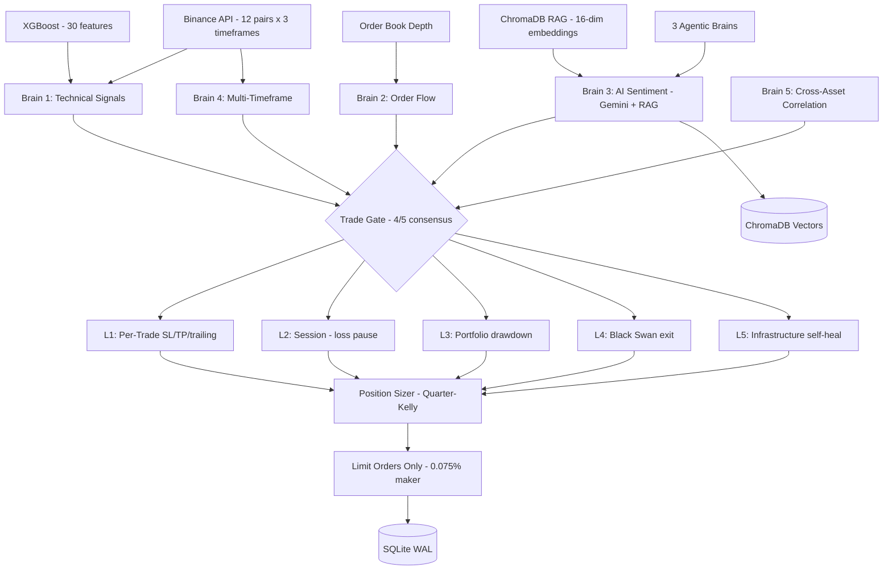

# Multi-Agent AI Trading System

An autonomous cryptocurrency trading system that combines **6 AI/ML techniques** into a single decision pipeline: LLM analysis (Gemini), XGBoost ML signals, Retrieval-Augmented Generation (RAG), market state embeddings, multi-agent consensus, and self-learning parameter optimization.

Deployed 24/7 on Oracle Cloud, trading 12 pairs on Binance with 5-layer autonomous protection.

---

## Architecture



## Problem Statement

Cryptocurrency markets operate 24/7 with extreme volatility, making manual trading impractical for retail investors. Existing automated solutions suffer from three core limitations:

1. **Single-signal dependency** — most bots use one indicator (e.g., RSI crossover) which fails when market conditions change
2. **No memory** — bots analyze each moment in isolation, unable to learn from their own trading history
3. **Brittle risk management** — a single stop-loss layer cannot protect against cascading failures (flash crashes, API outages, liquidity crises)

This project addresses all three by combining multiple AI/ML techniques into a unified decision pipeline with autonomous protection.

---

## Technical Deep Dive

### Multi-Brain Consensus Architecture

Rather than relying on a single signal source, the system implements a **5-brain voting mechanism** inspired by ensemble methods in machine learning. Each brain analyzes market conditions independently:

| Brain | Input | Method | Output |
|-------|-------|--------|--------|
| Technical Signals | OHLCV + indicators | Rule-based (RSI, MACD, BB) | BUY/SELL/HOLD + confidence |
| Order Flow | Order book depth | Statistical (imbalance ratio) | Direction + whale detection |
| AI Sentiment | Price + indicators + history | Gemini LLM + RAG context | Direction + reasoning |
| Multi-Timeframe | 5m, 15m, 1h candles | Cross-timeframe alignment | Agree/disagree signal |
| Cross-Asset | BTC, ETH, altcoin prices | Correlation tracking | Systemic risk signal |

A trade executes only when **4 of 5 brains agree** on direction, AND no brain shows a strong opposing signal (confidence > 0.65). This eliminates low-conviction trades and dramatically improves win rate at the cost of trade frequency.

### Retrieval-Augmented Generation (RAG)

The system maintains a **vector database** (ChromaDB) of every completed trade alongside its full market context. When analyzing a new trading opportunity:

1. The current market state is encoded as a **16-dimensional embedding vector** using handcrafted features (RSI, MACD, volume, regime, price momentum, order book imbalance)
2. ChromaDB performs **cosine similarity search** to find the 5 most similar historical scenarios
3. These historical outcomes are injected into the Gemini LLM prompt as context
4. Gemini analyzes current conditions informed by "what happened last time conditions looked like this"

This transforms the LLM from a stateless analyzer into one with **experiential memory** — the system literally learns from its own trading history without requiring model retraining.

**Embedding design choice:** We use handcrafted numerical feature vectors rather than transformer-based text embeddings. For structured financial data, domain-specific features (RSI normalized to [-1,1], log-scaled volume ratios, cyclical time encoding) outperform general-purpose text embeddings while running on minimal hardware (1 GB RAM server).

### Machine Learning Pipeline

An XGBoost binary classifier predicts whether a trade signal will be profitable, using a **30-dimensional feature vector**:

- **Price features (7):** Multi-window returns, momentum at 5/10/20 periods, price vs EMA distance
- **Volume features (4):** Volume ratio, trend, spike detection, consistency
- **Indicator features (8):** RSI + slope, MACD + crossover, Bollinger position + width, ATR%, ADX
- **Order book features (3):** Imbalance, spread, whale pressure
- **Regime features (3):** Encoded regime, confidence, stability
- **RAG features (3):** Historical win rate, average P&L, similarity score from similar scenarios
- **Time features (2):** Cyclical hour encoding (sin/cos to preserve circular nature)

Training uses **walk-forward validation**: train on the oldest 80% of data, validate on the newest 20%. This prevents look-ahead bias that plagues most backtesting. The model only deploys if validation accuracy exceeds 55%.

**Drift detection:** After deployment, the system tracks live prediction accuracy. If it drops more than 5% below the training baseline, the model auto-reverts to rule-based signals and flags for retraining.

### Agentic AI Layer

Three specialized AI agents reason autonomously about market conditions:

1. **Technical Agent** — analyzes chart patterns and indicator setups
2. **Sentiment Agent** — evaluates market regime, funding rates, fear/greed index
3. **Research Agent** — cross-references assets, queries RAG memory for historical patterns

Each agent has access to domain-specific **tools** (API queries, calculations, database lookups), produces a **chain-of-thought reasoning** trace, votes independently with a confidence score, and is **weighted by historical accuracy** — agents that have been more correct get more voting power.

### 5-Layer Autonomous Protection

| Layer | Scope | Response Time | Action |
|-------|-------|---------------|--------|
| L1: Per-Trade | Single position | Milliseconds | Hard stop-loss, trailing stop, time-based exit |
| L2: Session | Trading session | Minutes | Reduce size after 3 losses, pause after 5 |
| L3: Portfolio | Weekly/monthly | Hours | Scale down on drawdown, switch to defense mode |
| L4: Black Swan | Market-wide | Instant | Exit all positions on >5% move in 1 minute |
| L5: Infrastructure | System | Automatic | Auto-reconnect, crash recovery, graceful degradation |

Each layer operates independently — a failure in one does not compromise others. The system degrades gracefully: if Gemini API is down, it continues with technical signals only. If WebSocket disconnects, it falls back to REST polling. If the process crashes, systemd auto-restarts within 30 seconds.

---

## AI/ML Techniques Used

| # | Technique | Implementation | Purpose |
|---|-----------|---------------|---------|
| 1 | **LLM Integration** | Gemini 2.5 Flash API | Market regime analysis, sentiment, reasoning |
| 2 | **Machine Learning** | XGBoost classifier, 30 features | Predict trade profitability from indicators |
| 3 | **RAG** | ChromaDB + custom embeddings | Retrieve similar historical trades to augment Gemini |
| 4 | **Embeddings** | 16-dim market state vectors | Encode market snapshots for similarity search |
| 5 | **Multi-Agent AI** | 3 specialized agents + orchestrator | Parallel reasoning with accuracy-weighted voting |
| 6 | **Self-Learning** | Rolling 50-trade scoring + adaptive tuning | Auto-disable losing strategies, adjust parameters |

## How It Works

### Decision Pipeline (every 30 seconds)

1. **Fetch Data** — OHLCV candles from Binance for 12 pairs across 3 timeframes
2. **Compute Indicators** — RSI, MACD, Bollinger Bands, ATR, EMA, volume profiles
3. **Detect Regime** — classify market as trending/ranging/volatile/crash
4. **Select Strategy** — route to the best strategy for current conditions
5. **Collect Brain Signals** — 5 independent analysis layers vote on direction
6. **RAG Retrieval** — find 5 most similar historical scenarios from ChromaDB
7. **Gemini Analysis** — LLM analyzes with current data + historical context
8. **Trade Gate** — require 4/5 brain consensus, veto on strong opposing signals
9. **Risk Validation** — position sizing (quarter-Kelly), balance checks, limits
10. **Execute** — limit orders only (never market orders), maker fees

### Trading Strategies

| Strategy | Market Condition | Win Rate | R:R |
|----------|-----------------|----------|-----|
| Smart Scalp | All regimes (background) | 56-60% | 3:1 |
| Grid Trading | Ranging/sideways | 56-60% | 3:1 |
| Trend Momentum | Trending markets | 45-55% | 4:1 |
| Mean Reversion | Extreme moves | 55-60% | 3:1 |

### Backtest Results

Tested across 5 market conditions (normal, bull, bear, volatile, sideways):

| Strategy | Avg P&L | Win Rate | Max Drawdown | Pass Rate |
|----------|---------|----------|--------------|-----------|
| Volume Breakout | $5.70 | 60.0% | 0.7% | 5/5 |
| Vol Squeeze | $5.29 | 56.6% | 1.0% | 4/5 |
| Trend Momentum | $5.00 | 45.3% | 1.1% | 5/5 |
| Trend Pullback | $4.54 | 56.6% | 1.0% | 5/5 |

**Overall: 19/20 strategy-seed combinations pass** ($100 starting balance, fees included)

### System Specifications

| Metric | Value |
|--------|-------|
| Total codebase | 16,800+ lines of Python |
| Source files | 51 Python modules |
| Test files | 18 |
| Trading pairs | 12 (BTC, ETH, SOL, XRP, DOGE, BNB, ADA, AVAX, POL, LINK, DOT, NEAR) |
| Cycle interval | 30 seconds |
| Timeframes analyzed | 5m, 15m, 1h |
| Feature vector dimensions | 30 (ML) + 16 (embedding) |
| Deployment | Oracle Cloud Free Tier (Ubuntu 22.04, systemd) |

---

## Tech Stack

| Layer | Technology |
|-------|-----------|
| Language | Python 3.10+ (async/await) |
| Exchange | Binance via ccxt (REST + WebSocket) |
| LLM | Google Gemini 2.5 Flash |
| ML | XGBoost, scikit-learn |
| Vector DB | ChromaDB (persistent, cosine similarity) |
| Database | SQLite (WAL mode, async via aiosqlite) |
| Indicators | ta (RSI, MACD, BB, ATR, ADX, EMA) |
| Deployment | Oracle Cloud (Ubuntu 22.04, systemd) |
| Monitoring | Telegram alerts, structured logging |

## Project Structure

```
ai-trading-bot/                    # 16,800+ lines of Python
├── src/
│   ├── core/
│   │   ├── engine.py              # Main trading loop (585 lines)
│   │   ├── event_bus.py           # Async event system
│   │   ├── config.py              # YAML config loader
│   │   └── fast_engine.py         # Low-latency engine variant
│   ├── ai/                        # AI/ML Layer
│   │   ├── trade_gate.py          # Multi-brain consensus (4/5 vote)
│   │   ├── rag_memory.py          # ChromaDB RAG memory system
│   │   ├── embeddings.py          # Market state vector encoding
│   │   ├── ml_model.py            # XGBoost training + prediction
│   │   ├── ml_features.py         # 30-feature engineering pipeline
│   │   ├── agent_brain.py         # Autonomous brain agents
│   │   └── agent_orchestrator.py  # Multi-agent coordination
│   ├── strategies/                # Trading Strategies
│   │   ├── smart_scalp.py         # Fee-aware micro-scalping
│   │   ├── grid.py                # Volatility squeeze grid
│   │   ├── momentum.py            # Trend following (ADX + EMA)
│   │   ├── mean_reversion.py      # RSI extreme bounce
│   │   └── dex_arb.py             # Solana DEX arbitrage (Phase 8)
│   ├── intelligence/              # Market Intelligence
│   │   ├── gemini_brain.py        # Gemini LLM analysis + RAG
│   │   ├── market_regime.py       # Regime detection
│   │   ├── correlation.py         # Cross-asset correlation
│   │   ├── multi_timeframe.py     # Multi-TF alignment
│   │   ├── strategy_selector.py   # Dynamic strategy routing
│   │   └── macro_calendar.py      # Fed/CPI event awareness
│   ├── risk/                      # Risk Management
│   │   ├── manager.py             # Position sizing (Kelly criterion)
│   │   ├── protection.py          # 5-layer autonomous protection
│   │   └── position_sizer.py      # Dynamic sizing
│   ├── execution/                 # Order Execution
│   │   ├── paper_trader.py        # Simulated trading (fee-accurate)
│   │   ├── smart_exit.py          # 4-phase exit (normal→BE→trail→tight)
│   │   ├── trailing_stop.py       # Dynamic trailing stops
│   │   └── adaptive_sizer.py      # Win/loss streak sizing
│   ├── data/                      # Market Data
│   │   ├── feed.py                # Binance client (REST + WS)
│   │   ├── indicators.py          # Technical indicator engine
│   │   └── order_book.py          # Order book + whale detection
│   └── storage/
│       ├── database.py            # Async SQLite (trades, AI decisions)
│       └── models.py              # Data models
├── backtest/                      # Backtesting Framework
│   ├── engine.py                  # Walk-forward backtest engine
│   └── data_loader.py            # Historical data fetcher
├── config/
│   ├── settings.yaml              # Risk params, pairs, scaling tiers
│   └── strategies.yaml            # Per-strategy parameters
├── tests/                         # 18 test files
└── main.py                        # Entry point
```

## Key Engineering Decisions

**Why limit orders only?** Market orders pay taker fees (0.1%), limit orders pay maker fees (0.075%). On 20 trades/day, that's $0.50/day saved — 15% of daily target profit.

**Why 4/5 consensus?** Requiring 4 of 5 brains to agree eliminates low-confidence trades. Higher threshold = fewer trades but much better win rate.

**Why RAG over fine-tuning first?** RAG gives memory with zero training cost. The bot learns from its own history immediately. Fine-tuning needs 90+ days of data and GPU compute.

**Why quarter-Kelly sizing?** Full Kelly criterion is mathematically optimal but assumes perfect probability estimates. Quarter-Kelly (25% of optimal) provides 75% of the growth with much lower variance.

**Why 5 protection layers?** Each layer catches what the others miss. Per-trade stops catch single bad trades. Session protection catches losing streaks. Portfolio protection catches regime shifts. Black swan protection catches flash crashes. Infrastructure protection catches technical failures.

## Future Work

- **Phase 7:** Distill Gemini's reasoning chains into a smaller fine-tuned model (Gemma 2B) for faster, cheaper inference
- **Phase 8:** Solana DEX cross-pool arbitrage scanner (Jupiter, Raydium, Orca)
- **Performance dashboard:** Real-time web interface showing live P&L, trade history, and agent reasoning chains

## Security

- API keys stored in `.env` only (never in code, config, or commits)
- Binance API: read + spot trading only, **withdrawal disabled**
- IP whitelist on API key (server IP only)
- `.env` is `chmod 600` on server
- No secrets in logs or error messages

## Setup

```bash
git clone https://github.com/Leo-emp/AI-trading-bot-.git
cd AI-trading-bot-

python -m venv venv
source venv/bin/activate  # or venv\Scripts\activate on Windows
pip install -r requirements.txt

cp .env.example .env
# Edit .env with your Binance API keys and Gemini API key

python -m backtest.engine   # Backtest first
python main.py --slow       # Paper trade
```

## License

MIT
